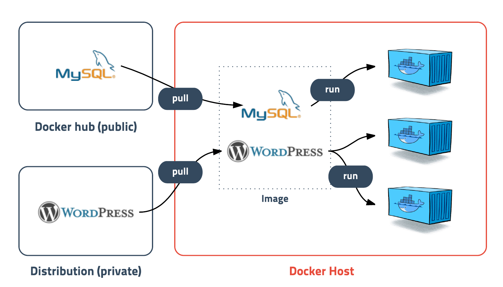

# VDMS-Dockerize-doc

##### VDMS 프로젝트를 docker 통해 자동화하는 방법을 문서로 정리하였습니다.

### Docker를 사용할 때 알아야 하는 개념들

##### 1. Docker 란?
> 도커는 2013년 3월 산타클라라에서 열린 Pycon Conference에서 dotCloud의 창업자인 Solomon Hykes가 The future of Linux Containers 라는 세션을 발표하면서 처음 세상에 알려졌습니다. 도커는 컨테이너 기반의 오픈소스 가상화 플랫폼입니다. 컨테이너라 하면 배에 실는 네모난 화물 수송용 박스를 생각할 수 있는데 각각의 컨테이너 안에는 옷, 신발, 전자제품, 술, 과일등 다양한 화물을 넣을 수 있고 규격화되어 컨테이너선이나 트레일러등 다양한 운송수단으로 쉽게 옮길 수 있습니다. 서버에서 이야기하는 컨테이너도 이와 비슷한데 다양한 프로그램, 실행환경을 컨테이너로 추상화하고 동일한 인터페이스를 제공하여 프로그램의 배포 및 관리를 단순하게 해줍니다. 백엔드 프로그램, 데이터베이스 서버, 메시지 큐등 어떤 프로그램도 컨테이너로 추상화할 수 있고 조립PC, AWS, Azure, Google cloud등 어디에서든 실행할 수 있습니다.

컨테이너를 가장 잘 사용하고 있는 기업은 구글인데 2014년 발표 에 따르면 구글은 모든 서비스들이 컨테이너로 동작하고 매주 20억 개의 컨테이너를 구동 한다고 합니다.
컨테이너는 격리된 공간에서 프로세스가 동작하는 기술입니다. 가상화 기술의 하나지만 기존방식과는 차이가 있습니다.

##### 2. Docker container
 
컨테이너는 격리된 공간에서 프로세스가 동작하는 기술입니다. 프로그램의 예를 들면 Docker image 는 클래스를 작성하는 것과 비슷하고, Docker container 는 작성한 클래스를 객체화 시킨 것과 비슷합니다. 가상화 기술의 하나지만 기존방식과는 차이가 있습니다.

##### 3. Docker 의 가상화기술
 
> 기존의 가상화 방식은 주로 OS를 가상화하였습니다. 우리에게 익숙한 VMware나 VirtualBox같은 가상머신은 호스트 OS위에 게스트 OS 전체를 가상화하여 사용하는 방식입니다. 이 방식은 여러가지 OS를 가상화(리눅스에서 윈도우를 돌린다던가) 할 수 있고 비교적 사용법이 간단하지만 무겁고 느려서 운영환경에선 사용할 수 없었습니다. 이러한 상황을 개선하기 위해 CPU의 가상화 기술(HVM)을 이용한 KVMKernel-based Virtual Machine과 반가상화 Paravirtualization방식의 Xen이 등장합니다. 이러한 방식은 게스트 OS가 필요하긴 하지만 전체OS를 가상화하는 방식이 아니였기 때문에 호스트형 가상화 방식에 비해 성능이 향상되었습니다. 이러한 기술들은 OpenStack이나 AWS, Rackspace같은 클라우드 서비스에서 가상 컴퓨팅 기술의 기반이 되었습니다. 가상머신과 도커 전가상화든 반가상화든 추가적인 OS를 설치하여 가상화하는 방법은 어쨋든 성능문제가 있었고 이를 개선하기 위해 프로세스를 격리 하는 방식이 등장합니다. 리눅스에서는 이 방식을 리눅스 컨테이너라고 하고 단순히 프로세스를 격리시키기 때문에 가볍고 빠르게 동작합니다. CPU나 메모리는 딱 프로세스가 필요한 만큼만 추가로 사용하고 성능적으로도 거어어어어의 손실이 없습니다. 도커의 기본 네트워크 모드는 Bridge모드로 약간의 성능 손실이 있습니다. 네트워크 성능이 중요한 프로그램의 경우 --net=host 옵션을 고려해야 합니다. 하나의 서버에 여러개의 컨테이너를 실행하면 서로 영향을 미치지 않고 독립적으로 실행되어 마치 가벼운 VMVirtual Machine을 사용하는 느낌을 줍니다. 실행중인 컨테이너에 접속하여 명령어를 입력할 수 있고 apt-get이나 yum으로 패키지를 설치할 수 있으며 사용자도 추가하고 여러개의 프로세스를 백그라운드로 실행할 수도 있습니다. CPU나 메모리 사용량을 제한할 수 있고 호스트의 특정 포트와 연결하거나 호스트의 특정 디렉토리를 내부 디렉토리인 것처럼 사용할 수도 있습니다. 새로운 컨터이너를 만드는데 걸리는 시간은 겨우 1-2초(체감 0.001초)로 가상머신과 비교도 할 수 없이 빠릅니다. 이러한 컨테이너라는 개념은 도커가 처음 만든 것이 아닙니다. 도커가 등장하기 이전에, 프로세스를 격리하는 방법으로 리눅스에서는 cgroupscontrol groups와 namespace를 이용한 LXCLinux container가 있었고 FreeBSD에선 Jail, Solaris에서는 Solaris Zones이라는 기술이 있었습니다. 구글에서는 고오오급 기술자들이 직접 컨테이너 기술을 만들어 사용하였고 lmctfy(Let Me Contain That For You)라는 뭐라고 읽어야 할지 알 수 없는 오픈소스 컨테이너 기술을 공개했지만 성공하진 못했습니다. 도커는 LXC를 기반으로 시작해서 0.9버전에서는 자체적인 libcontainer 기술을 사용하였고 추후 runC기술에 합쳐졌습니다.

##### 4. Docker image
 
> 도커에서 가장 중요한 개념은 컨테이너와 함께 이미지라는 개념입니다. 이미지는 컨테이너 실행에 필요한 파일과 설정값등을 포함하고 있는 것으로 상태값을 가지지 않고 변하지 않습니다(Immutable). 컨테이너는 이미지를 실행한 상태라고 볼 수 있고 추가되거나 변하는 값은 컨테이너에 저장됩니다. 같은 이미지에서 여러개의 컨테이너를 생성할 수 있고 컨테이너의 상태가 바뀌거나 컨테이너가 삭제되더라도 이미지는 변하지 않고 그대로 남아있습니다. ubuntu이미지는 ubuntu를 실행하기 위한 모든 파일을 가지고 있고 MySQL이미지는 debian을 기반으로 MySQL을 실행하는데 필요한 파일과 실행 명령어, 포트 정보등을 가지고 있습니다. 좀 더 복잡한 예로 Gitlab 이미지는 centos를 기반으로 ruby, go, database, redis, gitlab source, nginx등을 가지고 있습니다. 말그대로 이미지는 컨테이너를 실행하기 위한 모오오오오든 정보를 가지고 있기 때문에 더 이상 의존성 파일을 컴파일하고 이것저것 설치할 필요가 없습니다. 이제 새로운 서버가 추가되면 미리 만들어 놓은 이미지를 다운받고 컨테이너를 생성만 하면 됩니다. 한 서버에 여러개의 컨테이너를 실행할 수 있고, 수십, 수백, 수천대의 서버도 문제없습니다.

##### 5. Dockerfile
* [Dockerfile](./Dockerfile) 은 컨테이너 내부 환경을 정의하고 Docker image 외부 리소스와의 맵핑정보를 정의합니다. Dockerfile 에 정의된대로 Docker image 를 빌드할 수 있습니다. 빌드가 성공적으로 이루어진 이미지의 경우 Docker가 설치된 어디에서나 똑같이 실행될 것을 기대할 수 있습니다.

### 어떻게 VDMS 프로젝트를 자동화 할 수 있나?
